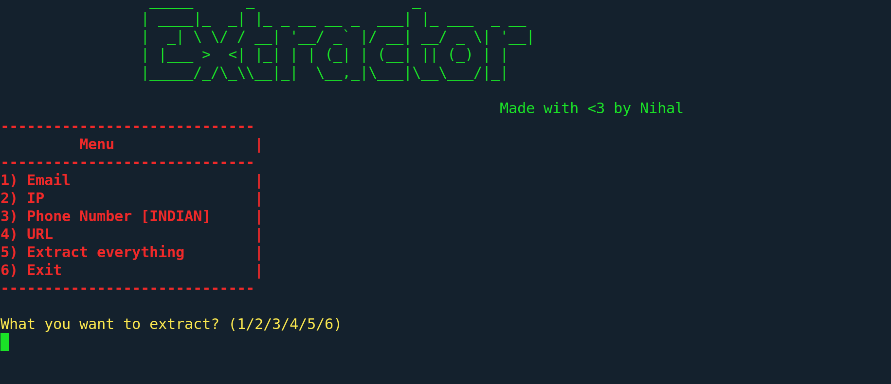

<h1 align="center">
   
  
   
  Extractor
   
</h1>

<h4 align="center">Extractor that pull out specific informations from a source file.</h4>

### Key Features

#### Data Extraction
Extractor can extract the following data:

- Emails
- IP Address
- Phone Numbers [INDIAN]
- URLs
- and many more are yet to come...... :)

### Concept
This tool uses Regular Expression (RegEx) to extract specific informations from a file.

### Note:-
I have tested this tool with the files having extensions like txt, html, json, xml, csv, js, css and many others. Extractor is incapable to pull out informations from a file in which the raw source code is exist in binary or in other format type except plain text.

### Suggestions are most welcome! feel free to commit :+1:

